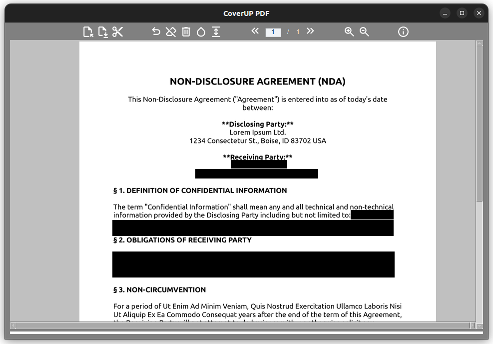

# WorkOnward Read Web — Secure PDF Redaction

A full-stack web version of [WorkOnward Read](../README.md) (based on CoverUP by Björn Seipel, GPL-3.0). Upload a PDF from your
computer, drag black or white bars over sensitive content (like Adobe Acrobat's
"Mark for Redaction"), and download a redacted PDF where the covered content is
**permanently removed** — not just hidden behind a box.

It reuses the desktop app's proven redaction model (inherited from CoverUP): every page is **rasterized to an
image**, the bars are **painted as solid pixels** onto that image, and a brand
new PDF is rebuilt from the images with **no text layer**. Covered content
cannot be recovered by copy/paste, `pdftotext`, "remove the overlay", or by
OCR-ing the redacted area.



## Run it (one URL)

```bash
cd web
./run.sh                       # builds the image and starts the container
# → open http://localhost:8090
```

or with compose:

```bash
cd web
docker compose up --build      # → http://localhost:8090
```

Stop it: `docker rm -f workonward-read-web` (or `docker compose down`).

> The bundled image serves the frontend **and** the API from one origin, so the
> whole product is a single URL. Processing happens in memory on your own
> instance — files are never written to disk or sent anywhere else.

## How to use

1. Upload a PDF (drag-and-drop or click).
2. Pick a bar color (**Black** or **White**) and drag rectangles over anything
   sensitive. Hover a bar and click **×** to remove it; **Undo** / **Clear**
   also work. **Zoom** doesn't affect where bars land.
3. Choose **High** (150 DPI) or **Compressed** (100 DPI) output.
4. Click **Redact & Download**.

Password-protected PDFs are supported — you'll be prompted when needed.

## Architecture

```text
web/
├── backend/
│   ├── redaction.py   # the engine: pypdfium2 render → Pillow paint → fpdf2 rebuild
│   ├── app.py         # FastAPI: POST /api/redact, GET /api/health, serves the SPA
│   └── requirements.txt
├── frontend/          # React + Vite + pdf.js
│   └── src/
│       ├── App.jsx            # upload → render → draw → download flow
│       ├── components/PageView.jsx   # canvas render + redaction overlay
│       ├── components/Toolbar.jsx
│       ├── components/Dropzone.jsx
│       ├── pdf.js            # pdf.js worker setup (bundled, same-origin)
│       └── api.js
├── Dockerfile         # multi-stage: node build → python runtime (one image)
├── docker-compose.yml
└── run.sh
```

**Flow:** the browser renders the PDF locally with pdf.js and records each bar
as **normalized** coordinates (`0..1` of the page, top-left origin — independent
of zoom and DPI). On download it POSTs the original file + the regions to
`/api/redact`; the backend rasterizes each page, paints the bars, and streams
back a flattened PDF.

### API

`POST /api/redact` — `multipart/form-data`:

| field      | type   | notes                                             |
|------------|--------|---------------------------------------------------|
| `file`     | file   | the PDF                                           |
| `regions`  | string | JSON array (see below)                            |
| `quality`  | string | `high` \| `compressed` (default `high`)           |
| `password` | string | optional, for encrypted PDFs                      |

```json
[
  { "page": 0, "x": 0.12, "y": 0.08, "w": 0.35, "h": 0.03, "color": "black" },
  { "page": 2, "x": 0.66, "y": 0.81, "w": 0.20, "h": 0.03, "color": "white" }
]
```

Returns `application/pdf` (the redacted file). Errors: `400` bad input,
`401` password required/incorrect, `413` too large, `422` unprocessable.

## Security model

- Output pages are **images only** — there is no text layer anywhere, so nothing
  is selectable or extractable, and content under the bars is overwritten pixels.
- The output is a **fresh** PDF, so the source's metadata, annotations,
  attachments, and hidden layers do not carry over.
- Every page is rasterized, even pages you didn't draw on — the whole document
  loses its text layer (this is intentional and matches the desktop app).
- Caveat: a bar only removes what it visually covers. Draw bars over the full
  extent of anything sensitive.

## Development

```bash
# backend (http://localhost:8080)
cd web/backend && pip install -r requirements.txt && uvicorn app:app --reload --port 8080

# frontend (http://localhost:5173, proxies /api → :8080)
cd web/frontend && npm install && npm run dev
```

### Tests

The `backend/_*.py` and `frontend/_ui_e2e.py` scripts are the verification
suite (engine, live API, rotated pages, and a real-browser Playwright run).
See the commands in each file's docstring.
